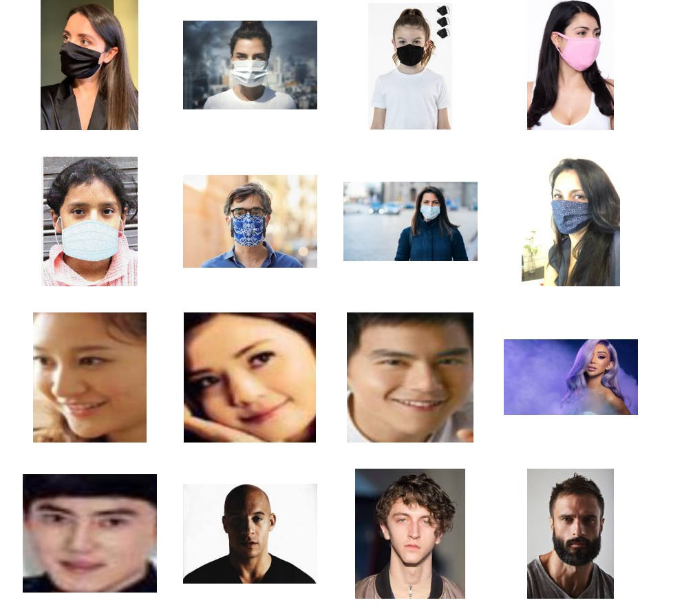

# Face Mask Image Classification using VGG16

## Deskripsi Dataset
- Jumlah dataset Training :  5000

- Jumlah dataset Validasi :  2553

- Jumlah train kelas Masker :  2500

- Jumlah train kelas Non Masker :  2500

- Jumlah validasi kelas Masker :  1225

- Jumlah validasi kelas Non Masker :  1328

## Content
- Kumpulan data terdiri dari 7553 gambar RGB dalam 2 folder sebagai withmask dan tanpamask. Gambar disebut sebagai label dengan masker dan tanpa masker. Gambar wajah dengan topeng adalah 3725 dan gambar wajah tanpa topeng adalah 3828.

## Acknowledgements
- Saya telah mengambil 1776 gambar termasuk gambar With and Without Face Mask dari akun Github Prajna Bhandary
  https://github.com/prajnasb/observations
Sisa 5777 gambar dikumpulkan dan disaring dari mesin pencari Google.

- 3725 Gambar Wajah dengan Masker

- 3828 Gambar Wajah tanpa Masker.

## Inspiration
- Terinspirasi oleh Adrian Rosebrock, PhD. Dengan bantuan bimbingannya di situs webnya https://www.pyimagesearch.com/ mudah untuk memahami dasar-dasar pemrosesan Gambar dan Deep Learning.

## Teknik Deep Learning yang digunakan
 - Model dengan menggunakan algoritma VGG16

## Authors
Kontributors dalam project ini adalah : 

- R Aldien Prayoga 201910370311413

- Aris Muhandisin   201910370311432
